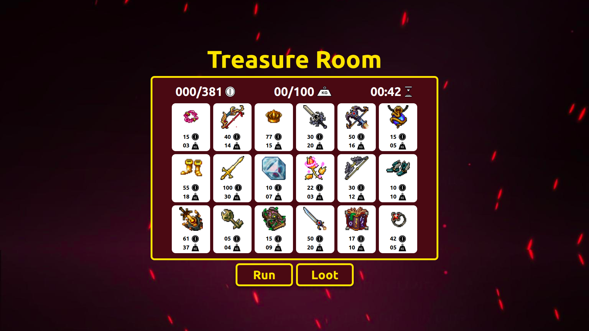
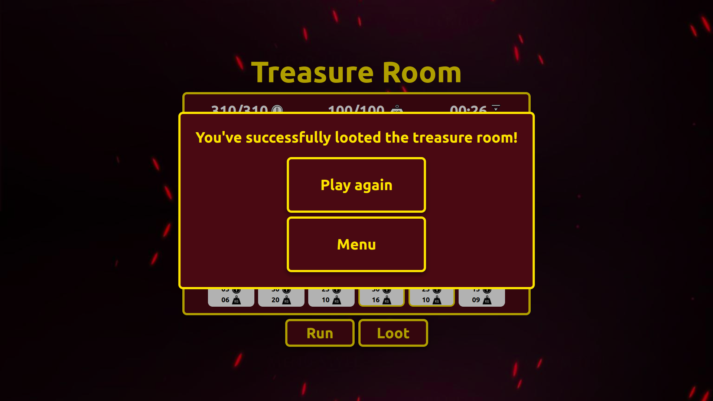

# DividirConquistar_LootMionsauro

# Loot Mionsauro

**Número da Lista**: 45<br>
**Conteúdo da Disciplina**: Dividir e Conquistar<br>

## Alunos
| Matrícula  | Aluno                       |
| ---------- | --------------------------- |
| 17/0114929 | Thiago França Vale Oliveira |

## Sobre
Loot Mionsauro é um projeto feito a partir do projeto [Kill Mionsauro](https://github.com/projeto-de-algoritmos/Greed_KillMionsauro) de alforitmos gananciosos. Foi adcionado um novo modo de jogo baseado no problema do Knapsack, sendo resolvido usando os princípios de dividir e conquistar e programação dinamica.

Após derrotar o dragão, o jogador conseguiu acesso a sua sala de tesouros, porém não consegue carregar todos eles em sua pequena mochila. Tomado pela ganância causada pelo tesouro, o jogador não consegue deixar a sala sem ter certeza de que saqueou o máximo de riquezas o possível, mas deve ser rápido nesse saque, pois o dragão pode acordar e pegar o saqueador com as mão em seu tesouro.

Cada tesouro possui um peso e valor específico, a missão do jogador é encontrar a combinação de tesouros (gerados aleatóriamente) que trará o maior saque o possível de acordo com sua capacidade máxima. O algoritmo determina qual o valor máximo que pode ser obtido e esse valor é indicado ao jogador que entra na sala de tesouros. Vale notar que o o tempo para que o dragão acorde també é indicado e caso o objetivo não seja alcançado a tempo, o jogador perde e poderá tentar novamente.

## Screenshots


*Figura 1: Página inicial do site*



*Figura 2: Sala do tesouro*



*Figura 3: Sucesso no saque*

## Vídeo de Apresentação

[Clique aqui para acessar o nosso vídeo!!](/Apresentacao.mp4)

## Instalação 
**Linguagem**: Typescript<br>
**Framework**: React<br>

### Clonando o repositório

Para clonar o repositório digite:

```console
git clone https://github.com/projeto-de-algoritmos/DividirConquistar_LootMionsauro.git
```
### Instalando as dependências

Após clonar o repositório baixe as dependências
```console
yarn install
```
ou
```console
npm i
```
### Executando o programa

Para execurtar o programa execute o comando:
```console
yarn start
```
ou
```console
npm start
```
Após realizar esses passos, a plataforma estará rodando na [porta 3000](http://localhost:3000/)
## Uso 

Para jogar basta selecionar a opção loot no menu inicial. Na sala do tesouro, selecione os tesouros que trarão o melhor saque e pressione loot para finalizar o saque. Também é possível selecionar a dificuldade, que poderá adicionar tempo extra permitindo mais calma nas decisões e uma margem de erro.

## Outros 
