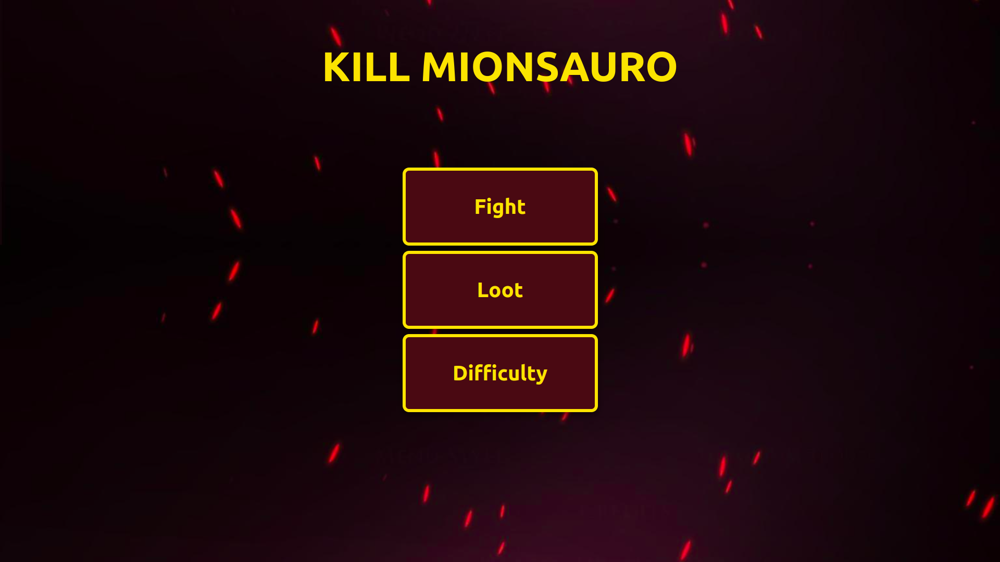

# Greed_KillMionsauro

# Kill Mionsauro

**Número da Lista**: 45<br>
**Conteúdo da Disciplina**: Greed<br>

## Alunos
| Matrícula  | Aluno                       |
| ---------- | --------------------------- |
| 17/0114929 | Thiago França Vale Oliveira |

## Sobre
Kill Mionsauro é um jogo onde o jogador deve derrotar o dragão Mionsauro. O dragão possui uma barra de HP (pontos de vida) que deve ser removida completamente pelo jogador ao usar a combinação exata de ataques que a levarão a zero.

A vida do monstro e o poder dos ataques disponíveis são gerados aleatóriamente, e a partir desses valores é determinado a quantidade máxima de turnos usando o algoritmo de CoinChange. Dessa forma, o jogador precisa encontrar a combinação exata de ataques para derrotar o dragão, pois caso o os pontos de vida de Mionsauro fiquem negativos, o monstro ira curar toda a sua vida.

## Screenshots



*Figura 1: Página inicial do site*


*Figura 2: Tela de batalha*


*Figura 3: Vitória na batalha*

## Vídeo de Apresentação


## Instalação 
**Linguagem**: Typescript<br>
**Framework**: React<br>

### Clonando o repositório

Para clonar o repositório digite:

```console
git clone https://github.com/projeto-de-algoritmos/Greed_KillMionsauro.git
```
### Instalando as dependências

Após clonar o repositório baixe as dependências
```console
yarn install
```
ou
```console
npm i
```
### Executando o programa

Para execurtar o programa execute o comando:
```console
yarn start
```
ou
```console
npm start
```
Após realizar esses passos, a plataforma estará rodando na [porta 3000](http://localhost:3000/)
## Uso 

Para jogar basta selecionar a opção fight no menu inicial. Na batalha selecione os ataques e bole uma estratégia para derrotar o monstro dentro da quantidade máxima de turnos.

## Outros 
